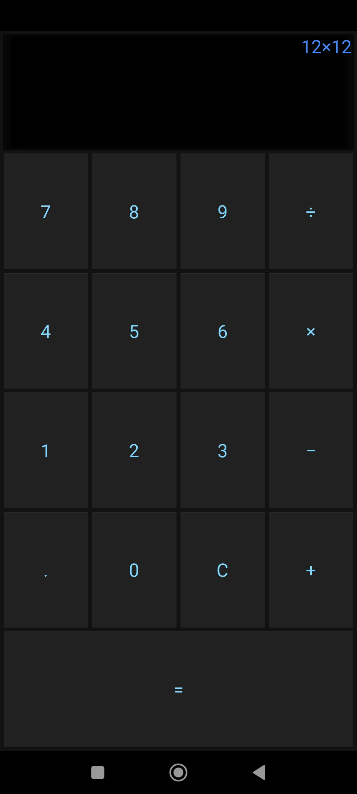

# Python Kivy app to Android APK
### Example of a Python Kivy app compiled to Adroid APK via Google Collab

Here you can find a set of resources aimed at helping       
compiling a Kivy Python app into a executable APK in Android.     
Normally you'd have a Linux machine to be able to compile     
but one is not needed, instead a Google collab is used.    

The example `main.py` is done from Kivy documentation.     
It's a very basic calculator that is still useful.     
Dark Material theme baked in.     

<hr>

Rename your app as `main.py`

Open Jupyter notebook named `PythonKivy2AndroidAPK.ipynb` in collab:     
https://colab.research.google.com/github/vluz/PythonKivy2AndroidAPK/blob/main/PythonKivy2AndroidAPK.ipynb

*Follow intructions in the notebook*

To answer (y/n) prompts, click the line, enter `y` and press Enter

When required, copy your app to the collab workspace.

Remember to edit `buildozer.spec` to match your app details.

At the end download your APK from the `bin` dir in the collab workspace.

<hr>

To compile for windows do:
```
nuitka main.py --onefile
```

After quite some time your executable will be in the same dir as python file.

<hr>

Screenshots:




<br>
